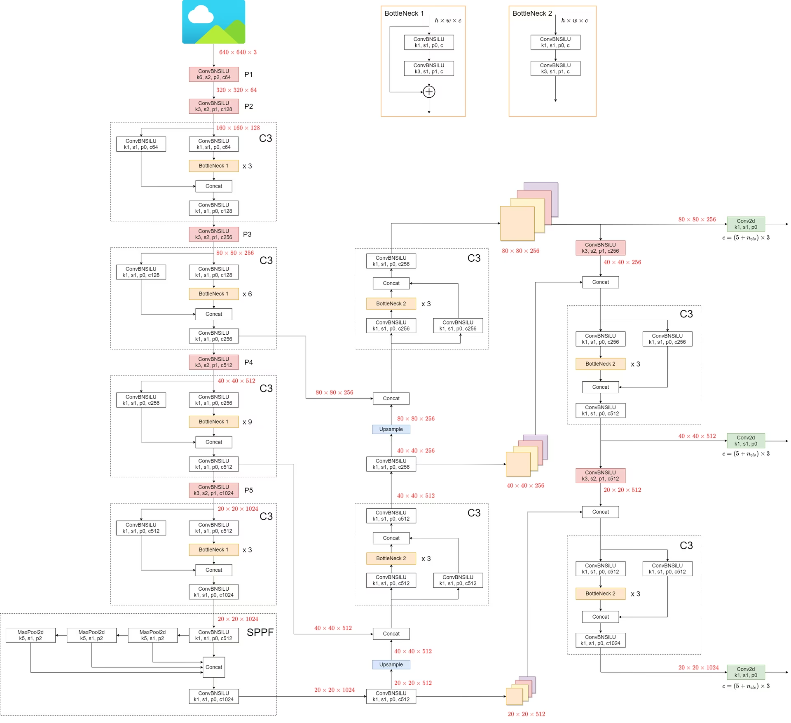

# 实验课 - Object Detection - Part 2

该代码库实现了一个简化版 YOLOv5 模型，包括训练、推理代码。

本实验的主要目的：
1. 如何使用 `.yaml` 配置模型。
2. 了解 YOLO 的基本结构。

模型结构如下：



## 环境准备

使用和 Simple-Faster-RCNN 相同的架构即可。

## Predict

```bash
python detect.py  # 如果配置有错误，请使用 `python detect.py --help` 或者直接查看源代码修改配置
```
